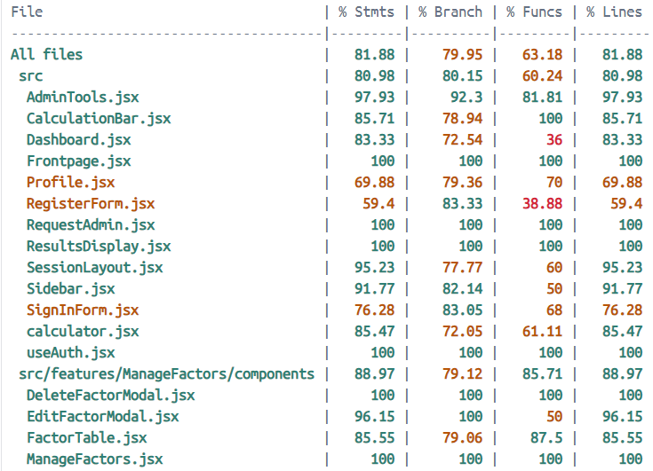

# SH14 Main

## Name

**Carbon Footprint Calculator**

## Description

The Carbon Footprint Calculator is a web-based tool built with React (frontend) and Django (backend) that enables users to track their carbon footprint. By entering daily activity data—such as energy consumption, travel, and waste management—users receive a detailed carbon emission analysis report.

This tool is designed to raise awareness of individual and corporate carbon footprints and provide actionable insights to reduce carbon emissions.

## Badges

[](https://stgit.dcs.gla.ac.uk/team-project-h/2024/sh14/sh14-main/-/pipelines)




## Visuals


## Installation

**Prerequisites**
Ensure you have the following installed before setting up:
- Node.js & npm: For running the frontend.
- Python 3 & pip: For running the backend.
- Docker & Docker Compose: Optional, for containerized deployment.
- PostgreSQL: If running outside of Docker.

1️⃣ Clone the Repository
```cmd
cd existing_repo
git clone https://stgit.dcs.gla.ac.uk/team-project-h/2024/sh14/sh14-main.git
```

2️⃣ Install Frontend Dependencies
```cmd
cd frontend
npm install
npm run dev
```
The frontend will start at: http://localhost:3000/

3️⃣ Set Up Backend
```cmd
cd backend
pip install
python manage.py migrate
python manage.py runserver
```
The backend API will be available at: http://localhost:8000/

4️⃣ Run with Docker
```cmd
docker-compose up --build
```

If you have any questions, please click [📄 Full Documentation](https://stgit.dcs.gla.ac.uk/team-project-h/2024/sh14/sh14-main/-/wikis/home/Documentation?redirected_from=Documentation)
 to see more details


## Usage

🔹 Register & Login
1. Navigate to the Home Page.
2. If you don't have account, please click on “Register” and enter:
    - Email (must belong to an educational institution (.ac.uk))
    - Unique Username
    - First & Last Name
    - Institution (organization name)
    - Research Field (area of study or profession)
    - Password (must meet security requirements)
3. Submit the form. A verification email will be sent.
4. Click the verification link in the email to confirm your account.
5. Return to the login page and sign in.

🔹 Navigate Tools by Sidebar
For Normal / Researcher User:
1. New Report
    - Allows users to create a new carbon footprint report.
2. Dashboard
    - Provides an overview of the user’s carbon footprint data, including past reports and analytics.
3. Request Admin
    - Request permission from the administrator

For Admin User:
Inherits the Add New Report and Dashboard functionality and has additional tools
1. Admin Tool
    - Available for administrators to manage user accounts and reports.
2. Manage Conversion Factors
    - Likely used for modifying emission conversion rates in calculations.

🔹 Using the Carbon Footprint Calculator
1. Go to the Sidebar and click "new report".
2. Enter your data details, such as:
    - Energy consumption (Utilities, Travel, Waste)
    - In Procurement, Select or look for the options you need from the drop-down menu
    - All the input data is summed up into the result
4. Click "submit" to save a carbon footprint report.

🔹 Viewing Historical Data
In the Dashboard, click "My Reports" to see past footprint analyses.
For Normal user:
- Can view their own report data
For Researcher user:
- Can view all the data for the same Institution
For Admin uesr:
- Can view all the data

🔹 Requesting Admin Access
- Regular users can request Researcher/Admin Privileges to manage carbon data.
- Submit a request via the Request Admin page.
- The request will be reviewed by an administrator.

🔹 Admin Tool (Admin Only)
- Mangement the Researcher/Admin Request
    - Can active Confirm or Deny to authorization

🔹 Managing Conversion Factors (Admin Only)
1. Click on "Manage Conversion Factors" in the sidebar.
2. You will see a list of emission conversion factors used in calculations.
3. Actions available:
    - Edit values: Adjust the conversion rates for energy usage, transportation emissions, etc.
4. Save changes to update the carbon footprint calculations.


## Support

If you encounter any bugs, errors, or missing features, please report them on our issue tracker:

[🔗 GitLab Issues](https://stgit.dcs.gla.ac.uk/team-project-h/2024/sh14/sh14-main/-/issues)

For detailed usage instructions, API references, and frequently asked questions, refer to our official documentation:

[📄 Full Documentation](https://stgit.dcs.gla.ac.uk/team-project-h/2024/sh14/sh14-main/-/wikis/home/Documentation?redirected_from=Documentation)


## Authors and acknowledgment

A huge thanks to everyone who contributed to this project!

🔗 [GitLab Contributors](https://stgit.dcs.gla.ac.uk/team-project-h/2024/sh14/sh14-main/-/graphs/main)

## Contract

Here is our team contract 

[📄 Team Contract](https://stgit.dcs.gla.ac.uk/team-project-h/2024/sh14/sh14-dissertation/-/wikis/Team-Contract)


